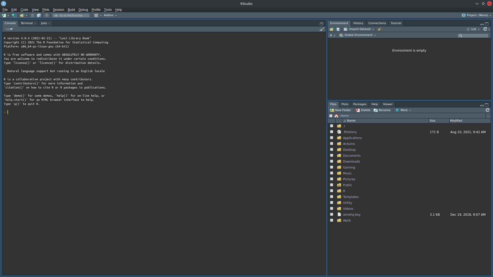

# Download R {#download}

The following page details instructions on how to download and install R and it's IDE, RStudio. These software will help inform your research projects throughout the summer internship program.

## Download and Install R

R is a free software environment for statistical computing and graphics. It compiles and runs on a wide variety of UNIX platforms, Windows and MacOS. 
It is a powerful tool for performing statistical analysis, graphing, GIS, and report creation.

Download R from the Comprehensive R Archive Network (CRAN) at:

https://cloud.r-project.org/

Please note:

- Windows users will download an executable installer (.exe)
- Mac users will download a package installer (.pkg)
- Linux users have access via package management systems
- R must be installed before RStudio

## Download and Install RStudio

Download RStudio Desktop from the RStudio team at:

https://www.rstudio.com/products/rstudio/download/#download

Please note:

- Windows users will download an executable installer (.exe)
- Mac users will download a disk image file (.dmg)
- Linux users will download a package file (.deb, .rpm)

# Introduction to R {#intro}

## Goals

By the end of the Lab, we will have learned:

- What R and RStudio are and are not
- How to download, install, and run R and RStudio
- How to install and load new R packages
- How to start performing math operations in R
- How to start graphing data in R

## R and RStudio

### What is R?

{width=25%}

- High level, interpreted, programming language
- Designed specifically for statistics and data science
- Functionality is expanded by the R community (*via packages*) and by the user (*via user-defined functions*)
- Prerequisite for RStudio


### What is RStudio?

{width=25%}

- Interactive Development Environment, software designed to make using R much easier
- Provides a Graphical User Interface and project management tools.
- Tool to help manage R projects, packages, and environments


## So what can R do for my project?


{width=25%}

Below are a list of examples to give some ideas as to how R can help inform your Green Team projects throughout the summer.

### Sort and Tabulate Data

R has many tools to help sort, filter, and manipulate data tables to create presentation-ready tables like this.

```{r echo=FALSE, message=FALSE, warning=FALSE}
# This chunk uses some examples from the mtcars dataset. 
# This dataset is pre-loaded into R, and is commonly used as an example data set for statistical tests and graphing.
# However, this data frame has the row names assigned as the make and model of the automobile, as we will see in the Table section below.
# This code will create a new data frame, removing the row names, and will add a vector of those names instead, which we can work with much easier.
kmtcars = mtcars # Make a copy of mtcars to process
kmtcars$model = rownames(mtcars) # Add a vector of data
rownames(kmtcars) = NULL
kmtcars = kmtcars %>% select(model, everything())

# Subset the data frame, choosing only the following columns.
# The example below includes both the functional and piped forms of this code, which behave the same.

# Functional Example
skmtcars = select(kmtcars,
                  model, 
                  mpg,
                  cyl,
                  disp,
                  hp
                  )

# Order the data frame in decreasing order of MPG
# Assign the order of the data frame to be in descending order of MPG. 
# In case of a tie, the first column value is used as a tie-breaker (i.e., is sorted alphabetically).
skmtcars = skmtcars[order(skmtcars$mpg, decreasing = T),] 
skmtcars = skmtcars[skmtcars$cyl==4,] # Subset the data frame, to only include
skmtcars = head(skmtcars)
rownames(skmtcars) = NULL # Reset the row numbers, otherwise, they will appear as a new column in our table.

kbl(skmtcars, # The data frame to print
  booktabs = T, # Use the booktabs package, loaded in the YAML section. This is generally recommended.
  escape = F, # This time the escape is F, because we want to process some escape characters; i.e., the '\n' used in our line breaks for our multi-row column names.
  longtable = T, # Use the longtable package, loaded in the YAML section. This supports tables that are long, supports tables that can wrap across pages. It also centers the table on the page. This is generally recommended.
  format = "pipe", # The document format. For this example, it is a pdf document, which uses LaTeX to render, so our format is latex.
  linesep = "", # A separator to include after each line / a set of lines. The default value puts a space every 5 items. This removes the space.
  col.names = linebreak(c("Make and Model", 
                          "Miles per Gallon",
                          "Number of Cylinders",
                          "Displacement in Cubic Inches",
                          "Gross Horsepower"
                          ),
                        align = c("l", 
                                  "c",
                                  "c",
                                  "c",
                                  "c"
                                  )
                        ),
  align = c("l",
            "c",
            "c",
            "c",
            "c",
            "c"
            ), caption = "Top Six Fuel Efficient  4-Cylinder Engines"
  )


```


### Plot Descriptive Statistics

R has strong graphical tools to help present descriptive statistics about the data that you collect.

```{r echo=FALSE, message=FALSE, warning=FALSE}
ggplot(mtcars, mapping = aes(x = mpg, y = hp)) + 
  geom_point() +
  labs(x = "Miles per Gallon", 
       y = "Horsepower", 
       title = "Fuel Economy and Performance", # The Bolded Graph Title
       subtitle = "Scatterplot of Fuel Efficiency Compared to Engine Performance " # The Graph Subtitle
      ) +
  # scale_y_continuous(labels = comma) +
  # scale_x_continuous(labels = comma) +
        theme(plot.title = element_text(hjust = 0.5), # centers the title
              plot.subtitle = element_text(hjust = 0.5), # centers the subtitle
              panel.background = element_blank(), # Removes greyscale background
              axis.line = element_line() # Adds black line border to x and y axis
      )
```


```{r echo=FALSE, message=FALSE, warning=FALSE}
ggplot(mtcars, mapping = aes(x = as.factor(cyl))) + 
  geom_bar() +
  labs(x = "Engine Cylinders", 
       y = "Number of Automobiles Recorded", 
       title = "Cylinders in Automobile Engines", # The Bolded Graph Title
       subtitle = "Bar Chart of the Engine Atributes of Vehicles Sampled" # The Graph Subtitle
      ) +
  # scale_y_continuous(labels = comma) +
  # scale_x_continuous(labels = comma) +
        theme(plot.title = element_text(hjust = 0.5), # centers the title
              plot.subtitle = element_text(hjust = 0.5), # centers the subtitle
              panel.background = element_blank(), # Removes greyscale background
              axis.line = element_line() # Adds black line border to x and y axis
      )
```


### Plot Statistical Tests 

R has strong statistical and graphical tools to help conduct your research and present your findings.

```{r echo=FALSE, message=FALSE, warning=FALSE}
ggscatter(mtcars,
          "mpg",
          "hp", 
          title = "Correlation Plot of \nFuel Economy by Performance", 
          xlab = "Miles per Gallon",
          ylab = "Horsepower",
          add = "reg.line", 
          conf.int = T,
          cor.coef = T
          )
```


```{r echo=FALSE, message=FALSE, warning=FALSE}
ggboxplot(mtcars, 
          "am",
          "mpg", 
          title = "Boxplot of Fuel Economy by Transmission Type", 
          xlab = "Engine Transmission Type", 
          ylab = "Miles per Gallon" 
          )


```


### Plot Principal Component Analysis

R supports many varied types of analysis, such as Principal Component Analysis.

```{r echo=FALSE, message=FALSE, warning=FALSE}
mtcars.pca = prcomp(mtcars[,c(1:7,10,11)], 
                    center = T,
                    scale. = T)
mtcars.country <- c(rep("Japan", 3), rep("US",4), rep("Europe", 7),rep("US",3), "Europe", rep("Japan", 3), rep("US",4), rep("Europe", 3), "US", rep("Europe", 3))
ggbiplot(mtcars.pca, 
         choices = 1:2,
         # labels = rownames(mtcars),
         groups = mtcars.country,
         ellipse = T,
         var.axes = F
) + 
  labs(title = "Principal Component Analysis \nof Automobile Atributes", # The Bolded Graph Title
       subtitle = "PCA of 32 Sampled Automobiles, with 9 Principle Components" # The Graph Subtitle
       ) +
  # scale_y_continuous(labels = comma) +
  # scale_x_continuous(labels = comma) +
        theme(plot.title = element_text(hjust = 0.5), # centers the title
              plot.subtitle = element_text(hjust = 0.5), # centers the subtitle
              panel.background = element_blank(), # Removes greyscale background
              axis.line = element_line() # Adds black line border to x and y axis
      )
```


### Map Choropleth and Geo-spatial Data

R also supports geo-spatial analysis and creating GIS visuals.

We can make interactive maps within web pages.
```{r echo=FALSE, message=FALSE, warning=FALSE}
data(World, metro, rivers, land)

##
m1 = tm_shape(World[World$continent %in% c("South America", "North America"),]) +
  tm_polygons("life_exp", 
              title = "Years") + 
  tm_legend(legend.outside = T,
            legend.outside.position = "right",
            hist.width=1,
            hist.height=.25, 
            hist.bg.color="gray60", 
            hist.bg.alpha=.5) +
  tm_layout(frame = F,
            main.title = "Life Expectency in North America",
            main.title.position = "center",
            main.title.size = 1
  )


tmap_mode("view")
m1

```

We can also make static maps for publication.
```{r echo=FALSE, message=FALSE, warning=FALSE}
##
m2 = tm_shape(land) +
  tm_raster("elevation", 
            palette = terrain.colors(10), 
            title = "Elevation",
            ) +
  tm_legend(legend.outside = T,
            legend.outside.position = "right",
            hist.width=1,
            hist.height=.25, 
            hist.bg.color="gray60", 
            hist.bg.alpha=.5) +
  tm_layout(frame = F,
            main.title = "Global Elevation Above Sea Level",
            main.title.position = "center",
            main.title.size = 1
            )  

tmap_mode("plot")
m2

```

## Render Documents

R and RStudio also come with support for authoring documents: RMarkdown.

This presentation and web page were created in R!
It is created using R Markdown, which combines Markdown formatting and R code.
Using this, we can make tables and graphs quickly, and generate plots and graphics, without worrying about document formatting or image resolution.
We can create Power Point presentations, web pages and dashboards, books, pdfs, and word documents.

# Intro to R Lab {#intro-lab}

This is the first guided lab section, and will act as a quick introduction to how to begin using R and its Interactive Development Environment (IDE) RStudio.

## The R Console


R is run inside of your computer's terminal, and can be accessed interactively via command line interface, or passively via scripting.
R is launched via the `R.exe` application on Windows, or through the terminal via `R`, as a variable in your `PATH`. The R console can be used as an interactive session, or be used for scripting by more experienced users.

R commands are run interactively in the console line-by-line, or by writing and executing an R source file (.R file).

The R Console is a powerful tool, and a prerequisite for RStudio. You will rarely need to use the R console outside of RStudio, as the IDE provides you with easier access to the R Console.


## RStudio




RStudio is run as a desktop application, which acts as an easier way to interact with the R console. 
RStudio provides the following features in its multi-panel layout:

- a file and graphics viewer (on the bottom right pane by default), 
- an environment viewer to keep track of data and variables used by the R session (on the top right pane by default),
- access to the R console (on the bottom left pane by default), and
- access to a document editor with syntax-highlighting (on the top left pane by default).

RStudio allows for a much easier experience running R commands interactively in the console line-by-line, or writing and executing an R source file (.R file).

Launch RStudio now if you have not done so already. You should see a screen similar to the one above. You will be able to follow along with the examples provided in this lab session.

## Run and Source R Code

Running R Code is the process of giving instructions to R one line (one complete instruction) at a time.

- R code can be run interactively both in the R console and RStudio file editor. 
- Code is run one line or command at a time using `Enter`, when typed into the console.
- The selected line, or one whole complete instruction, in an R source file open in RStudio can be run using `Ctrl+Enter` on Windows and Unix or `Cmd+Enter` on Mac.


Sourcing R Code is the process of giving many instructions to R at once from a specific file source.

- R code can be saved as an R source file (.R) to use later
- Source files can be run in their entirety using the `source()` function, or in RStudio, using `Ctrl+Shift+S` on Windows and Unix or `Cmd+Shift+S` on Mac.
- Source files can be shared with partners, or used on different computers to create repeatable results.


## Install R Packages

R packages are installed in the console via the `install.packages()` function. This will install packages from CRAN, the Comprehensive R Archive Network. Packages in development or not on CRAN are installed via the `install_github()` function, in the package `devtools`. Packages can be searched for and installed with a GUI as well within RStudio.


```{r echo=TRUE, message=FALSE, warning=FALSE, eval=FALSE}
# This code segment will install the package ggplot2
# ggplot2 is used to create graphics in R
# Note that when installing a package, we need to put the name in quotes
install.packages("ggplot2")
```


## Load R Packages

R packages are loaded in the console via the `library()` function. This will load packages that have already been installed into the current R environment. Once a package is loaded, it is loaded for the remainder of the R session, and is not script dependent. Note that some packages have dependencies and may benefit from being loaded in a specific order. Packages can be searched for and loaded with a GUI as well within RStudio.


{width=50%}
```{r echo=TRUE, message=FALSE, warning=FALSE, eval=FALSE}
# This code segment will load the package ggplot2
# ggplot2 is used to create graphics in R
# Note that when loading a package, the name is not in quotes
library(ggplot2)
```

## Object Assignment

One of the most important features of R is object assignment, as R is an Object Oriented Language.

```{r echo=TRUE, message=FALSE, warning=FALSE, eval=TRUE}
# This code segment will assign a list of numbers to an object.
# We use `=` to assign values (the right side) to an object (the left side).
# The c() function binds data separated by `,` into a vector for us to reference later.

# using `:`, we can assign all values of 1 through 10 inclusive, as shorthand.
x = c(1:10)

# Or, we can assign specific values.
# We can also use the `left assign` character `<-` to assign values. It behaves the same as `=`.
y <- c(2, 2, 5, 6, 7)
```

We can view the contents of an object by calling that object. By default, this will return the contents of the object to the console output. If you would like to view the contents in a new pane, you need to use the `View()` function.

```{r echo=TRUE, message=FALSE, warning=FALSE, eval=TRUE}
# Call an object that we have assigned
x
y

# We can also use View(), but it has no effect in this lab document
# View(x)
```

## Math Operations

At its core, R is a tool for math and data science. The following code displays some of the math operators used by R.

```{r echo=TRUE, message=FALSE, warning=FALSE, eval=TRUE}
# This code segment demonstrates some of the math operations in R
# Addition
2+2

# Subtraction
10-5

# Multiplication
5*2

# Division
100/5

# Exponents
5^2

# Notation (*10^x)
1e3
1e-3
```

We can also calculate descriptive statistics. This will typically be done using a vector, like we assigned above.

```{r echo=TRUE, message=FALSE, warning=FALSE, eval=TRUE}
# This code segment demonstrates some of the descriptive statistics operations in R
# Mean
mean(x)

# Median
median(y)

# Min
min(x)

# Max
max(x)

# Sum (total)
sum(x)
```

## Data Frames and Vectors

Data Frames and Vectors will be the most common types of data that we work with. A data frame is a 2-dimensional table, and a vector is a 1-dimensional list. Typically, vectors represent the columns of our data frames.

```{r echo=TRUE, message=FALSE, warning=FALSE, eval=FALSE}
# Lets look at a sample data set, mtcars
# mtcars is a sample data set with data about cars
# We start by calling the object
mtcars
```

```{r echo=TRUE, message=FALSE, warning=FALSE, eval=FALSE}
# We can see how many entries are in our data table using nrow()
# it counts the number of rows
nrow(mtcars)
```

We can call a data frame to see all of the data available. If we want to reference a specific part of the data frame, we will need to use vectors.

```{r echo=TRUE, message=FALSE, warning=FALSE, eval=FALSE}
# Lets look at a specific vector (column) of mtcars
# We need to call the object, and its vector, using the `$`
# This example will reference the mpg column from the data frame mtcars
# This vector has data about the Miles per Gallon of each car
mtcars$mpg
```

```{r echo=TRUE, message=FALSE, warning=FALSE, eval=FALSE}
# We can see how many entries are in our vector using length()
# it counts the number of items in the vector or list
length(mtcars$mpg)
```


## Math with Data Frames

Why would we want to reference a vector? Vector references are the main way to generate graphs, perform math operations, or perform statistical analysis. Lets combine our descriptive statistics with this vector example.

```{r echo=TRUE, message=FALSE, warning=FALSE, eval=TRUE}
# Descriptive stats with vectors of data
# The highest Miles per Gallon
max(mtcars$mpg)

# The lowest Miles per Gallon
min(mtcars$mpg)

# The Average Miles per Gallon
mean(mtcars$mpg)

# The difference in performance from the highest to lowest mpg
max(mtcars$mpg) - min(mtcars$mpg)

# Calculating the Mean manually using the sum of MPG and the number of entries.
# This should be equal to the mean statement above
sum(mtcars$mpg) / length(mtcars$mpg)
```


## Descriptive Plots

We can help describe our data with the plotting functionality of R.
Box plots (sometimes box and whisker plots) are helpful for graphing the descriptive stats of a sample, including: minimum, maximum, median, quartile distribution, and inter-quartile range.

```{r echo=TRUE, message=FALSE, warning=FALSE, eval=TRUE}
# A boxplot can help tell us about the descriptive stats of a sample.
boxplot(mtcars$mpg)
```

This graphic is not ready to present to someone without titles and labels however.

```{r echo=TRUE, message=FALSE, warning=FALSE, eval=TRUE}
# A boxplot can help tell us about the descriptive stats of a sample.
boxplot(mtcars$mpg, 
        xlab = "mtcars Sample",
        ylab = "MPB",
        main = "Distribution of Fuel Economy in mtcars")
```

More advanced graphics can be made comparing data that we have in our sample. In this next example, we can examine the mpg of cars based on how many cylinders are in their engines. Based on the plot, we have reason to believe that there is a real difference in MPG based on how many cylinders are in an engine.

```{r echo=TRUE, message=FALSE, warning=FALSE, eval=TRUE}
# A boxplot can help tell us about the descriptive stats of a sample, based on what group it is in.
# the `~` denotes that we want to look at mpg, based on the value in `cyl`
boxplot(mtcars$mpg~mtcars$cyl,
        xlab = "Number of Cylinders in Engine",
        ylab = "MPG",
        main = "Distribution of Fuel Economy by Engine Composition")
```

We can also plot histograms to examine the distributions within our samples.

```{r echo=TRUE, message=FALSE, warning=FALSE, eval=TRUE}
# A histogram, plotting frequency of response
hist(mtcars$mpg, 
     main = "Histogram of mtcars MPG", 
     xlab = "Reported Miles per Gallon"
     )
```


All of the plots so far have used the native functionality of R. To make higher-quality, or just different, graphs, we will need to load a new library. The package `ggplot2` is the graphics workhorse behind most of the publication-ready plots rendered in R. Note that it uses many more arguments to create a graph, but that this can produce far more dynamic graphs. 


As we just saw, R is not great at creating bar charts by default. We can add the package `ggplot2` to create a new type of graph.

```{r echo=TRUE, message=FALSE, warning=FALSE, eval=TRUE}
# Load the prerequisite library
library(ggplot2)

ggplot(mtcars, mapping = aes(x = as.factor(cyl))) + 
  geom_bar() +
  labs(x = "Engine Cylinders", 
       y = "Number of Automobiles Recorded", 
       title = "Cylinders in Automobile Engines", # The Bolded Graph Title
       subtitle = "Bar Chart of the Engine Atributes of Vehicles Sampled" # The Graph Subtitle
      ) +
        theme(plot.title = element_text(hjust = 0.5), # centers the title
              plot.subtitle = element_text(hjust = 0.5), # centers the subtitle
              panel.background = element_blank(), # Removes greyscale background
              axis.line = element_line() # Adds black line border to x and y axis
      )
```


We can also create different styles of scatter charts using `ggplot2`.

```{r echo=TRUE, message=FALSE, warning=FALSE, eval=TRUE}
# Load the prerequisite library
library(ggplot2)

ggplot(mtcars, mapping = aes(x = hp, y = mpg)) + 
  geom_point() +
  labs(x = "Horsepower", # x axis
       y = "Miles per Gallon", # y axis
       title = "Fuel Economy and Performance", # The Bolded Graph Title
       subtitle = "Scatterplot of Fuel Efficiency Compared to Engine Performance " # The Graph Subtitle
      ) +
        theme(plot.title = element_text(hjust = 0.5), # centers the title
              plot.subtitle = element_text(hjust = 0.5), # centers the subtitle
              panel.background = element_blank(), # Removes greyscale background
              axis.line = element_line() # Adds black line border to x and y axis
      )
```

We can expand on ggplot with another package, `ggpubr`, which is designed to help with publication-ready graphics made using `ggplot2. In this case, we can enhance our scatter plot to now display the correlation as well.

```{r echo=TRUE, message=FALSE, warning=FALSE, eval=TRUE}
# Load the prerequisite library
library(ggplot2)
library(ggpubr)

ggscatter(mtcars,
          "hp",
          "mpg",
          title = "Correlation Plot of Fuel Economy\nby Engine Performance", 
          xlab = "Horsepower",
          ylab = "Miles per Gallon",
          add = "reg.line", # Draw a regression line
          conf.int = T, # Adds a confidence interval
          cor.coef = T # Adds the Correlation
          ) + 
        theme(plot.title = element_text(hjust = 0.5), # centers the title
              plot.subtitle = element_text(hjust = 0.5), # centers the subtitle
              panel.background = element_blank(), # Removes greyscale background
              axis.line = element_line() # Adds black line border to x and y axis
      )
```

## Statistical Analysis and Tests

The main strength of R is in the ability to quickly perform statistical analysis on our data, and generate summary or descriptive statistics.
We can use the `table()` function to make a contingency table to quickly count the number of responses in our data.

```{r echo=TRUE, message=FALSE, warning=FALSE, eval=FALSE}
# Make a table of responses.
# This will count the number of times each response was selected.
# In this case, we can quickly count how many cars were sampled from each engine type.
table(mtcars$cyl)

```

We can also generate descriptive statistics about data using another package, `Hmisc`.

```{r echo=TRUE, message=FALSE, warning=FALSE, eval=FALSE}
# Install the prerequisite package
install.packages("Hmisc")
```

The `describe()` function will generate descriptive statistics about data that we have collected.

```{r echo=TRUE, message=FALSE, warning=FALSE, eval=FALSE}
# Load the prerequisite library
library(Hmisc)
describe(mtcars$cyl)

```


## Goals

At the end of the Lab, we have learned:

- What R and RStudio are and are not
- How to download, install, and run R and RStudio
- How to install and load new R packages
- How to start performing math operations in R
- How to start graphing data in R

